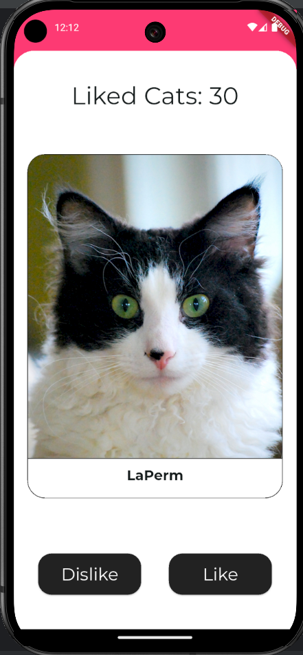
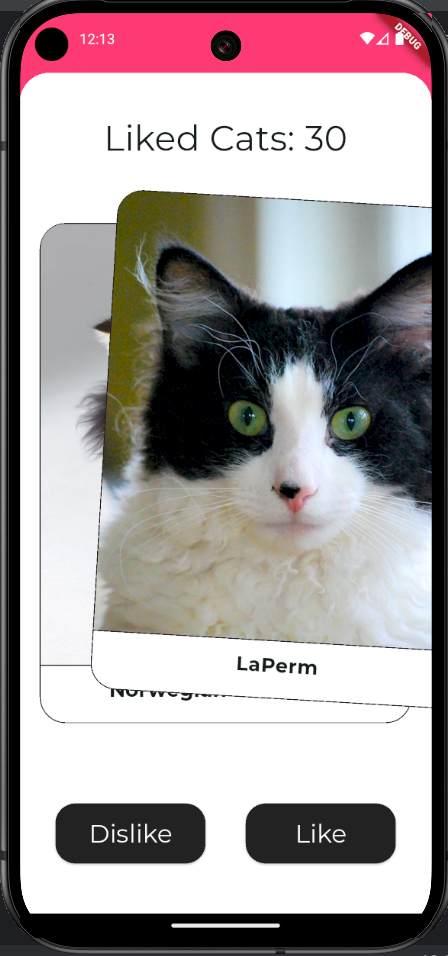
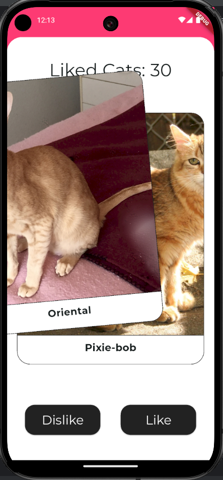
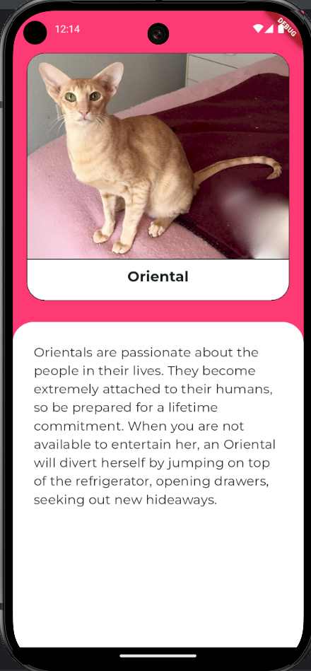
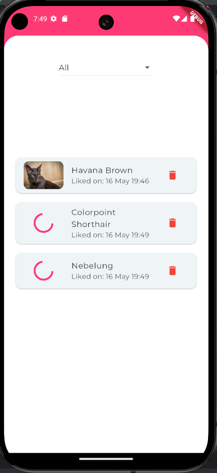
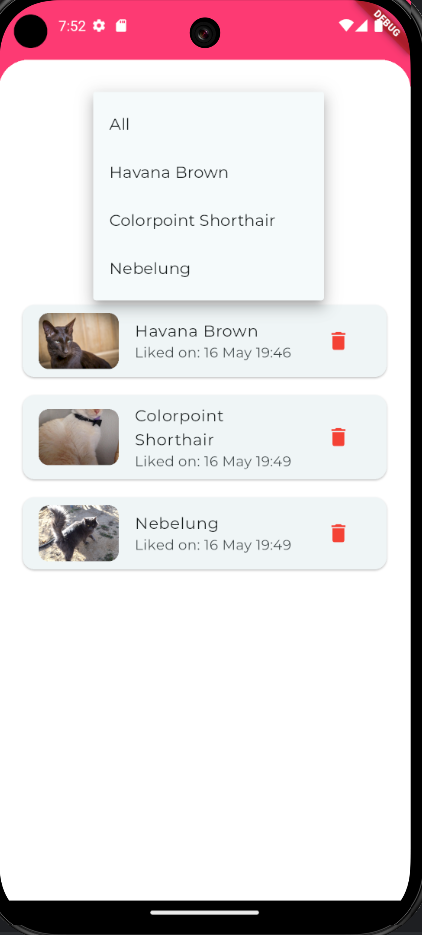
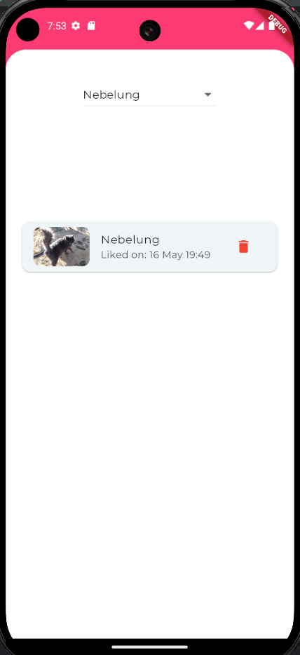
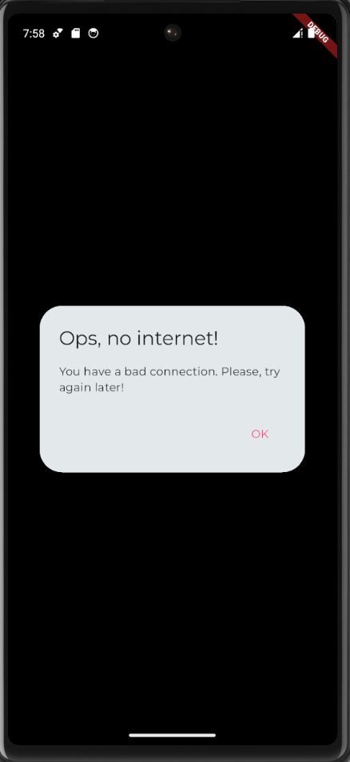
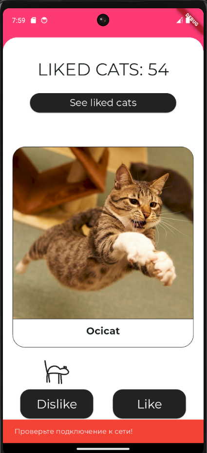

# catinder

Домашнее задание по курсу разработки на flutter от Яндекса. Авторка - Судакова Дарья.

## Описание 
Catinder - аналог тиндера для любителей котиков. Надоело искать пару в настоящем тиндере? Выбери, какого котика завести с помощью Catinder.
Приложение позволяет свайпать разные породы котиков вправо - лайкать, - или влево - дизлайкать, - а также смотрнть более детальное описание пород.
Надеюсь, все котики будут залайканы.

## Ссылка на скачивание
https://disk.yandex.ru/d/v0Hcsyq5orugeg

## Реализованные фичи 

1. На главном экране отображается изображение котика и его порода, ниже находятся кнопки "лайк" и "дизлайк". 

2. Котиков можно свайпать влево (эквивалентно нажатию кнопки дизлайк) и вправо (эквивалентно нажатию кнопки лайк).

   
 

4. После свайпа/нажатия на кнопку котик сменяется на нового случайного.
5. Есть счетчик лайкнутых котиков, отображается вверху (Liked cats)
6. При нажатии на котика открывается экран с детальным описанием и информацией про породу.
   

7. Можно посмотреть лайкнутых котиков. Для этого надо перейти с главного экрана с помощью кнопки See liked cats
8. В случае, если картинки долго не загружаются, отображается progress bar
9. Котиков можно фильтровать по породе

10. Котики сохраняются в локальной БД Drift
11. Лайкнутые котики также хранятися в базе данных и остаются при перезагружке приложения.
12. В случае отсутствия интернета пользователю высвечиваются алерт диалоги о необходимости проверить сеть (с помощью пакета connectivity_plus)

## Cat API
Информация о котиках берется из [Cat API](https://thecatapi.com) с помощью search search?has_breeds=1&limit=15. Котики подгружаются из очереди.

